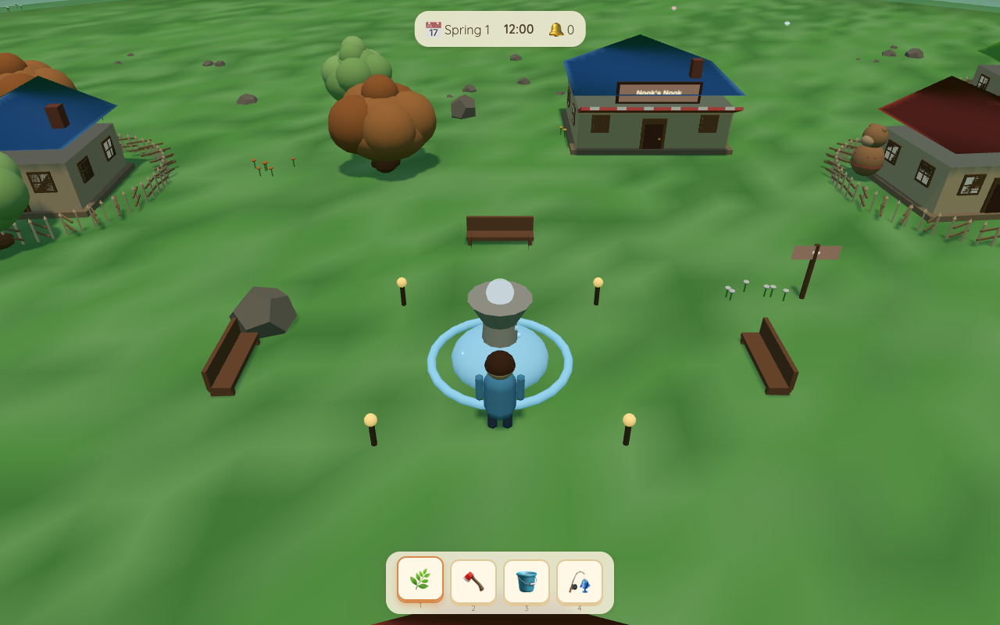

# Willowbrook 🌳

> A cozy little town game in the spirit of Animal Crossing — built in Three.js, runs in any modern browser, no build step.



A friendly bear baker named Maple waves you in. Five villagers wander the plaza, a fountain cascades, lantern light catches the grass at dusk. Walk in, talk to whoever you find, plant a flag — and the town grows warmer.

## Run it

No `npm install`, no bundler. Just a static server:

```bash
python3 -m http.server 8080
# then open http://localhost:8080
```

Or any other static-file server pointed at this folder. The game uses an importmap for `three` so it loads directly from a CDN.

## What's in here

```
willowbrook/
├── index.html              Splash + HUD shell
├── progress.html           Live build progress page
├── src/                    14 small modules, each judged independently
│   ├── main.js             Bootstrap, game loop, camera, autostart hooks
│   ├── world.js            Terrain, sky dome, trees, fountain, river, clouds, stars, day/night cycle
│   ├── player.js           Avatar, walk cycle, camera anchor
│   ├── npc.js              Five villagers, species bodies, AI routines, dialogue
│   ├── buildings.js        Houses, plaza, Nook's Nook, museum, fences
│   ├── interiors.js        Fade-to-black swap, home / shop / museum rooms
│   ├── time.js             Clock, calendar, season
│   ├── audio.js            WebAudio synth pad + chirps + SFX
│   ├── inventory.js        Slots, items, tools
│   ├── ui.js               HUD, dialogue box, toast
│   ├── interactions.js     Talk, forage, enter buildings, level-complete trigger
│   ├── save.js             localStorage persistence
│   ├── particles.js        Footstep puffs, pickup sparkles
│   ├── weather.js          Occasional rain showers
│   └── cutscene.js         Fullscreen video overlay (intro, meet-Maple, end)
├── videos/
│   ├── v2-intro.mp4        Plays on "Visit Town" — dawn over Willowbrook
│   ├── v2-meet-maple.mp4   Plays first time you talk to Maple
│   └── v2-complete.mp4     Plays after meeting everyone + earning 100 bells
├── .critique/              Wave-by-wave critic reviews + screenshots
│   ├── wave-1-critique.md
│   ├── wave-2-critique.md
│   ├── wave-3-critique.md
│   ├── wave-3b-critique.md
│   └── shots/              40+ headless-Chrome renders at every time of day
└── .waves/                 Builder's notes for each wave
```

## Story beats

The three cutscenes are part of the experience:

| Beat | When | What plays |
|------|------|------------|
| **Intro** | Click `Visit Town` on splash | Dawn establishing shot of the town |
| **Meet Maple** | First time you press E on Maple (the bear baker) | She gives you a plate of star cookies; you walk away with 3 apples |
| **Welcome home** | First time you stand on the plaza after meeting all 5 villagers AND earning 100+ bells | The whole town gathers at the fountain; "Welcome Home, Friend" |

Each cutscene has a 1.5s minimum before ESC / click / space skips it.

## Controls

- **WASD** or **arrow keys** — walk
- **Shift** — run
- **E** / **Space** / **Enter** — talk to the nearest villager / open the nearest building
- **1-4** or click the hotbar — pick a tool / item
- **Esc** — close dialogue / skip cutscene

## Crit-driven build

This wasn't a one-shot. We broke it into pieces and ran each through a **fresh-context harsh critic sub-agent** who compared the running game to actual Animal Crossing screenshots. After each round the critic named one biggest gap; the builder closed it; loop.

| Wave | Critic verdict |
|------|----------------|
| 1 | FAIL — trees were icosahedra, fountain was a brown disc, horizon had a hard black band |
| 2 | FAIL — fountain water wasn't mounding, trees too tall, fence corners broken |
| 3 | FAIL — dawn sky math wrong, water mound invisible, fossils all the same sphere, interiors floated in void |
| 3b | **PASS** — all five fixes verified visually |

Read the full critic reviews in `.critique/`.

## Tech notes

- **Pure Three.js** (no Babylon, no engine wrapper). `importmap` pulls `three@0.160.0` from a CDN.
- **No assets** at first — everything was procedural meshes, CanvasTexture signs, and WebAudio synth. Once we generated three `MiniMax-H3` videos with `mmx-cli`, those became the only binary content.
- **No build step.** Edit a file → refresh the browser.
- **Headless test mode** — `?autostart=1&hour=12&x=0&z=4&shot=NAME` boots straight into the game at a chosen time/position and writes a screenshot. Used by the critic loop.

## Credits

- **Three.js** — geometry, lighting, materials
- **MiniMax-H3** (`mmx-cli`) — the three cinematic clips in `videos/`
- **Animal Crossing** — the design language we're paying tribute to (shout-out to Nintendo; we are obviously a low-poly tribute, not affiliated)

— Willowbrook · built with Mavis (MiniMax Code)
